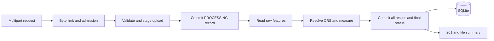

# Geospatial File Measurement API

FastAPI and SQLite API for uploading KML or zipped Shapefiles, preserving feature attributes and geometry, and measuring local survey polygons and lines in a suitable projected CRS.

Uploads finish synchronously. A successful request returns `201 Created`; invalid individual features are retained with issues while the remaining features are processed. The service uses deterministic coordinate rules and does not use an LLM.

## Run locally

Use Linux (or WSL) and Python 3.12. The instance lock uses Linux/Unix `fcntl`. Install [uv](https://docs.astral.sh/uv/getting-started/installation/), then run these commands from the project root:

```bash
uv sync --locked --python 3.12
cp .env.example .env
uv run alembic upgrade head
uv run uvicorn app.main:app --workers 1
```

Open [interactive API documentation](http://127.0.0.1:8000/docs). SQLite and temporary staging directories live under `data/`; set `GEO_DATA_DIR` to change this. Run exactly one API process against a local persistent data directory. Startup verifies migrations, required GDAL drivers, and PROJ; it refuses to run on an unmigrated database.

The lock file may remain on disk after shutdown; its existence is harmless. The operating-system lock determines whether an instance is running. Do not delete the lock file while the service is running.

## Run with Docker

```bash
docker compose up --build -d
docker compose logs -f api
```

The image installs dependencies from `uv.lock`, verifies the Pyogrio runtime's **ESRI Shapefile and LIBKML** drivers during build and startup, applies migrations, and starts one Uvicorn worker as an unprivileged user. Compose binds to localhost and persists SQLite in the `measurements` volume. `docker compose down` preserves the volume. The image targets the Linux runtime; driver availability is checked rather than inferred from system GDAL installation.

## Requests and responses

```bash
curl -i -F 'file=@samples/survey.kml' http://127.0.0.1:8000/api/files/
curl -i -F 'file=@samples/projected_polygons.zip' http://127.0.0.1:8000/api/files/
curl -i -F 'file=@samples/missing_crs.zip' -F 'source_crs=EPSG:4326' \
  http://127.0.0.1:8000/api/files/
```

Copy the returned `id` into these requests:

```bash
curl http://127.0.0.1:8000/api/files/FILE_ID/
curl 'http://127.0.0.1:8000/api/files/FILE_ID/measurements/?limit=50&offset=0'
curl http://127.0.0.1:8000/ready/
```

| Endpoint | Behavior |
|---|---|
| `POST /api/files/` | Multipart `file`, optional `source_crs`; returns a completed file summary and `Location` header |
| `GET /api/files/{id}/` | Filename, format, status, CRS, layers/fields, counts, warnings and file error |
| `GET /api/files/{id}/measurements/` | Results ordered by `feature_index`; default limit 50, maximum 200 |
| `GET /health/` | Process health |
| `GET /ready/` | Required runtime and database availability |

A measurement item has this shape (coordinates and values below are abbreviated for illustration; actual values are not rounded):

```json
{
  "feature_index": 0,
  "source_feature_id": "0",
  "layer_index": 0,
  "layer_name": "dataset",
  "geometry_type": "LineString",
  "geometry": {"type": "LineString", "coordinates": [[75, 18.09], [75.003, 18.093]]},
  "geometry_crs": "OGC:CRS84",
  "source_crs": "EPSG:32643",
  "properties": {"name": "Feature 0"},
  "measurement_status": "MEASURED",
  "measurement": {
    "kind": "length", "value": 500.0, "unit": "m",
    "measurement_crs": "EPSG:32643", "method": "projected_utm_2d"
  },
  "errors": [], "warnings": []
}
```

Every API error uses an envelope like this:

```json
{
  "error": {
    "code": "CRS_REQUIRED",
    "message": "Include a valid .prj file or provide source_crs.",
    "request_id": "generated-request-uuid",
    "file_id": "generated-file-uuid-or-null",
    "details": []
  }
}
```

Request IDs also appear in the `X-Request-ID` header. `file_id` is null when validation failed before a database record was created. No input attribute names are hardcoded. Inspect `layers[].fields` for discovered names and reader types; each feature's `properties` holds its values. Reader-provided source IDs can repeat between layers; `(file_id, feature_index)` is the stable result identity.

## Coordinate systems and measurements

There are three distinct coordinate representations:

1. **Source CRS:** describes the uploaded coordinates. KML specifies WGS84. Shapefile `.prj` metadata is used when valid. If missing or unreadable, the uploader must supply an EPSG identifier. Conflicting metadata and input are rejected. There is no coordinate-based guessing.
2. **Output geometry:** two-dimensional GeoJSON in WGS84 longitude/latitude order (`OGC:CRS84`). Source WKB, including supported Z values, and source WKT remain in SQLite. Raw uploaded files are deleted after processing.
3. **Measurement CRS:** each measurable feature is transformed into the WGS84 UTM zone containing its geographic bounding-box centre. North uses EPSG:326xx; south uses EPSG:327xx. Longitude boundaries are clamped to zones 1–60. All inputs follow this rule, including projected data expressed in feet.

The working geometry must lie between 80°S and 84°N, have a longitude span no greater than 180°, and have a geographic bounding-box diagonal no longer than 100 km. The diagonal is checked on the WGS84 ellipsoid. These are per-feature limits: separate local features can occupy different regions. A compact feature crossing a UTM zone boundary uses the centre's zone.

Polygon area subtracts holes; multipart polygon areas and line lengths are summed. Points have status `NOT_APPLICABLE` and a null measurement. Geometry collections are retained as `UNSUPPORTED`. Empty, undecodable, invalid, over-complex, or untransformable features receive errors. Invalid geometry is never repaired automatically. Output geometry is null if it cannot safely be decoded or transformed.

Measurements are **2D projected estimates**, in metres or square metres. Elevation, terrain slope, and cadastral surveying corrections are not included. UTM introduces location-dependent distortion; the extent policy is not a guarantee of a particular survey accuracy. Transformations use explicit XY order, reject ballpark operations, require the best transformation, and disable network grid downloads. Missing required transformation resources become feature errors.

## Architecture and failure behavior



| Module | Responsibility |
|---|---|
| `main.py`, `schemas.py`, `middleware.py` | API contracts, request IDs, byte counting, admission |
| `uploads.py`, `reader.py` | Safe staging, archive/XML validation, layer schemas, raw WKB |
| `crs.py`, `measurement.py` | Pure CRS policy, transformations, attribute normalization, measurements |
| `processing.py` | Deadline, processing workflow, file state and cleanup |
| `models.py`, `database.py`, `migrations/` | Persistence, constraints, transactions and recovery |
| `runtime.py` | Driver checks, instance lock and startup cleanup |

The async route offloads blocking work to a worker thread and waits for it to finish. Sessions are created and closed inside that thread. No transaction stays open while geometry is processed. A short transaction creates `PROCESSING`; a final transaction inserts every result and publishes the terminal status atomically. A failure rolls back all feature inserts, then records `FAILED` separately when storage permits.

SQLite uses foreign keys, WAL, `synchronous=FULL`, and a five-second busy timeout. One upload is admitted at a time; additional uploads receive `503 SERVICE_BUSY` and `Retry-After: 5`. Reads remain available. A filesystem lock prevents a second instance from incorrectly recovering the first instance's active records. Use local storage, not a network-mounted SQLite database.

| Situation | Result |
|---|---|
| All features measured or valid points | `201`, `COMPLETED` |
| Some/all features invalid or unsupported | `201`, `COMPLETED_WITH_ERRORS`; inspect feature issues |
| Unsupported extension | `415` |
| Malformed dataset, missing/conflicting CRS, incomplete reader extraction | `422`; no partial results |
| Request/file/archive/global feature or coordinate limit | `413`; no partial results |
| Unknown ID | `404` |
| Results still processing / failed file | `409` with status-specific error |
| SQLite busy, unavailable storage, processing deadline | `503` |
| Unexpected programming failure | `500`, rollback and logged traceback |

The cooperative processing deadline is 60 seconds, checked between stages/features. It **cannot interrupt a native GDAL call**. Request-body reception has a separate 30-second timeout. Processing of a fully received upload is shielded from cancellation so client disconnection can still leave a committed result. A process crash can leave `PROCESSING`; startup marks it `FAILED / PROCESS_INTERRUPTED`. Startup also cleans abandoned application-owned staging directories. Cleanup failure is logged without reversing a committed success. Reupload creates a new ID; there is no deduplication or durable job queue.

## Input safety and limitations

Defaults are configurable through `.env.example`: 10 MiB file, 12 MiB complete request, 50 MiB expanded ZIP, 100 ZIP members, 50 layers, 10,000 features, 500,000 coordinates total, and 50,000 per feature. These are operating limits, not benchmark claims. The request is counted and spooled before multipart parsing, including when `Content-Length` is absent. Native readers can allocate memory before coordinate counts become available; container memory limits should be sized through workload testing.

ZIPs must contain exactly one matching `.shp`, `.shx`, `.dbf` set. `.prj` and `.cpg` are supported. Subdirectories and case-insensitive filenames work. Ambiguous paths, traversal, links, encryption, and unsupported compression are rejected. Only selected dataset components are extracted to generated paths. Declared and actual extracted byte limits are checked.

KML preflight rejects DTDs, entities, excessive XML nesting and `NetworkLink`. External styles are disabled. Styles and overlays generate warnings and are not reproduced. All LIBKML vector layers and exposed attributes are read. Source WKB is the geometry delivered by the driver, not a byte-for-byte reconstruction of the source document. LIBKML can normalize KML constructs; presentation, unsupported extensions and XML formatting are not preserved. Reader warnings fail the file conservatively because warnings may indicate skipped data. KML Placemark counts are compared with extracted feature counts to avoid claiming complete extraction after silent omission.

This submission has no authentication, ownership or retention API. Run it locally as documented; internet deployment would need those product decisions and resource isolation.

## Verification and sample data

```bash
uv run pytest -q
uv run ruff check .
uv run ruff format --check .
uv run alembic check
```

The checked-in samples are original synthetic fixtures; tests do not download datasets. See [sample descriptions](samples/README.md) and [expected values](samples/expected.json). Regenerate them with `uv run python -m scripts.generate_samples`.

Projected reference shapes have known areas of 10,000, 9,600 and 20,000 m², and a known line length of 500 m. Numerical tests allow 0.00001 absolute error for projection round trips. A zone-boundary line is also compared with an independent ellipsoidal length using 0.2% relative tolerance; this is a fixture-specific comparison, not a universal accuracy claim.

Tests cover API contracts, KML layers, CRS conflicts/missing metadata, feet/custom WKT, hemispheres, unsupported/invalid geometry, attribute normalization, resource limits, archive/XML rejection, transaction rollback, restart recovery, upload admission, cleanup, and startup driver checks. CI checks formatting, tests, migrations and image construction.

## Assignment mapping and design choices

| Assignment requirement | Implementation |
|---|---|
| KML and zipped Shapefile uploads | Multipart POST, validated staging and Pyogrio/GDAL |
| Extract identity, type, geometry, CRS and properties | Layer metadata, sequential indices, source IDs, WKB + GeoJSON, arbitrary properties |
| Projected polygon area and line length | Strict PyProj transformations, deterministic per-feature UTM, Shapely |
| Points and unsupported types | Explicit null measurement and feature status/issues |
| Upload, file info and measurement endpoints | Three `/api/files/` routes, paginated results |
| Persistence and graceful failures | SQLite, migrations, atomic result publication, recovery |
| Setup, architecture, alternatives and future scope | This README and [architecture notes](docs/architecture.md) |

Approach A keeps the submission runnable with one service and one database while making correctness and failures reviewable. SQLite is suitable for the single writer policy. Separate ingestion, CRS and measurement functions leave a clear path to workers or PostGIS without changing public feature semantics.

The main engineering lessons are that coordinate units alone do not establish measurement suitability, file parsing can fail before individual geometry decoding, thread offloading is not durable job execution, and CRS metadata must remain distinct from both output and measurement CRS. [Architecture notes](docs/architecture.md) explain Approaches B/C and their failure handling.
